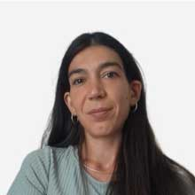
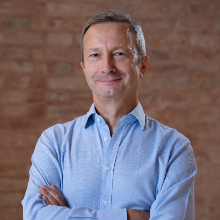
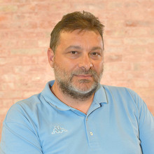
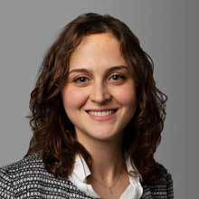
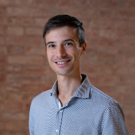
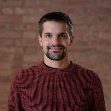

So.Sta. is an interdisciplinary collaboration across statistics, social statistics and sociology. The profiles below link to each member’s personal or institutional webpage.

<article class="card" style="margin:18px 0;display:grid;grid-template-columns:140px 1fr;gap:22px;align-items:center">

Social Statistics

<h3 style="margin:.15em 0"><a href="https://angeella.github.io/" target="_blank">Angela Andreella</a></h3>

Ca’ Foscari University of Venice

Statistical inference for complex and dependent data, resampling, multiple testing, mixed models and applications in health and social sciences.

</article>

<article class="card" style="margin:18px 0;display:grid;grid-template-columns:140px 1fr;gap:22px;align-items:center">

Social Statistics

<h3 style="margin:.15em 0"><a href="https://www.unive.it/people/alberto.arletti" target="_blank">Alberto Arletti</a></h3>

Ca’ Foscari University of Venice

Statistical modelling for population health, morbidity trends, data integration and public-health applications.

</article>

<article class="card" style="margin:18px 0;display:grid;grid-template-columns:140px 1fr;gap:22px;align-items:center">

Sociology

<h3 style="margin:.15em 0"><a href="https://www.unive.it/people/michele.bertani" target="_blank">Michele Bertani</a></h3>

Ca’ Foscari University of Venice

General sociology, welfare, social policy and the study of complex social systems.

</article>

<article class="card" style="margin:18px 0;display:grid;grid-template-columns:140px 1fr;gap:22px;align-items:center">

Social Statistics

<h3 style="margin:.15em 0"><a href="https://www.unive.it/people/gaia.bertarelli" target="_blank">Gaia Bertarelli</a></h3>

Ca’ Foscari University of Venice

Social statistics, health data, small-area estimation and methods for complex population data.

</article>

<article class="card" style="margin:18px 0;display:grid;grid-template-columns:140px 1fr;gap:22px;align-items:center">

Social Statistics

<h3 style="margin:.15em 0"><a href="https://www.unive.it/people/stefano.campostrini" target="_blank">Stefano Campostrini</a></h3>

Ca’ Foscari University of Venice

Population health, surveillance systems, health inequalities, ageing and translation of statistical evidence into policy.

</article>

<article class="card" style="margin:18px 0;display:grid;grid-template-columns:140px 1fr;gap:22px;align-items:center">

Sociology

<h3 style="margin:.15em 0"><a href="https://www.unive.it/people/michele.marzulli" target="_blank">Michele Marzulli</a></h3>

Ca’ Foscari University of Venice

Sociology of welfare, public policy, health systems, social innovation and inequalities.

</article>

<article class="card" style="margin:18px 0;display:grid;grid-template-columns:140px 1fr;gap:22px;align-items:center">

Statistics

<h3 style="margin:.15em 0"><a href="https://www.unive.it/people/pastore" target="_blank">Andrea Pastore</a></h3>

Ca’ Foscari University of Venice

Statistical modelling and applied statistics, with work on health, ageing and morbidity.

</article>

<article class="card" style="margin:18px 0;display:grid;grid-template-columns:140px 1fr;gap:22px;align-items:center">

Social Statistics

<h3 style="margin:.15em 0"><a href="https://www.unive.it/people/marta.pittavino" target="_blank">Marta Pittavino</a></h3>

Ca’ Foscari University of Venice

Applied and social statistics, health and population data, statistical modelling and inference.

</article>

<article class="card" style="margin:18px 0;display:grid;grid-template-columns:140px 1fr;gap:22px;align-items:center">

Statistics

<h3 style="margin:.15em 0"><a href="https://lorenzo-schiavon.github.io/" target="_blank">Lorenzo Schiavon</a></h3>

University of Padua

Bayesian statistics, latent-variable models, complex and high-dimensional data.

</article>

<article class="card" style="margin:18px 0;display:grid;grid-template-columns:140px 1fr;gap:22px;align-items:center">

Social Statistics

<h3 style="margin:.15em 0"><a href="https://sites.google.com/view/stivalmat/" target="_blank">Mattia Stival</a></h3>

Ca’ Foscari University of Venice

Bayesian modelling, repeated cross-sectional surveys, spatial and temporal heterogeneity, public-health applications.

</article>

<article class="card" style="margin:18px 0;display:grid;grid-template-columns:140px 1fr;gap:22px;align-items:center">

Statistics

<h3 style="margin:.15em 0"><a href="https://www.unive.it/people/stone" target="_blank">Stefano Tonellato</a></h3>

Ca’ Foscari University of Venice

Statistical modelling, time series, computational statistics and complex data.

</article>