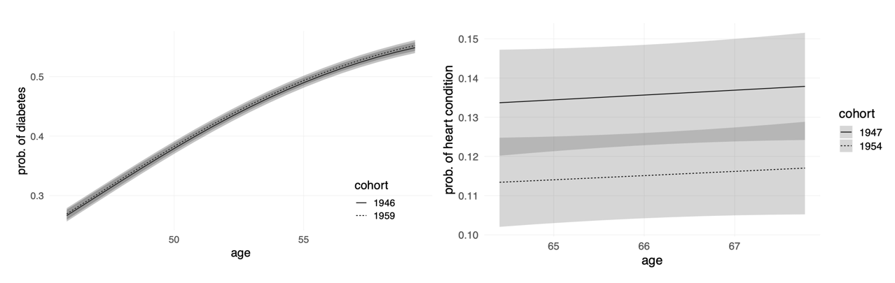
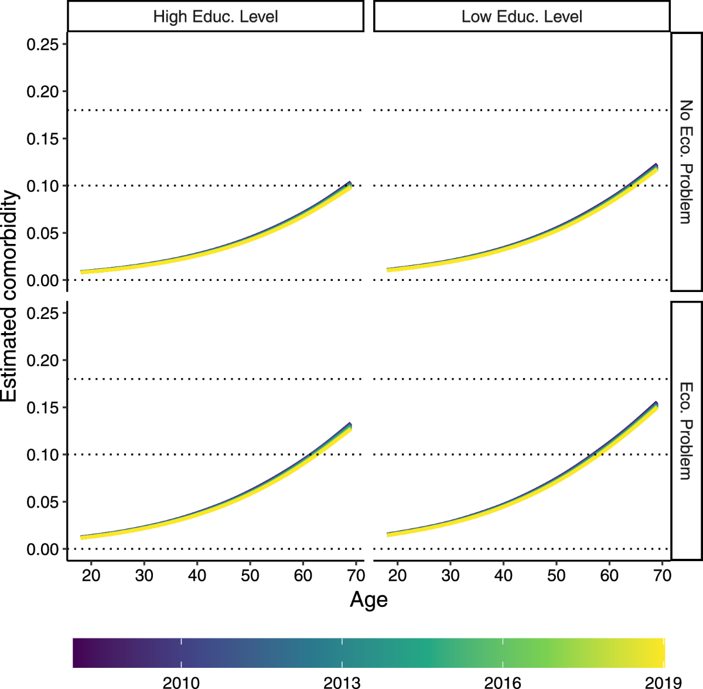
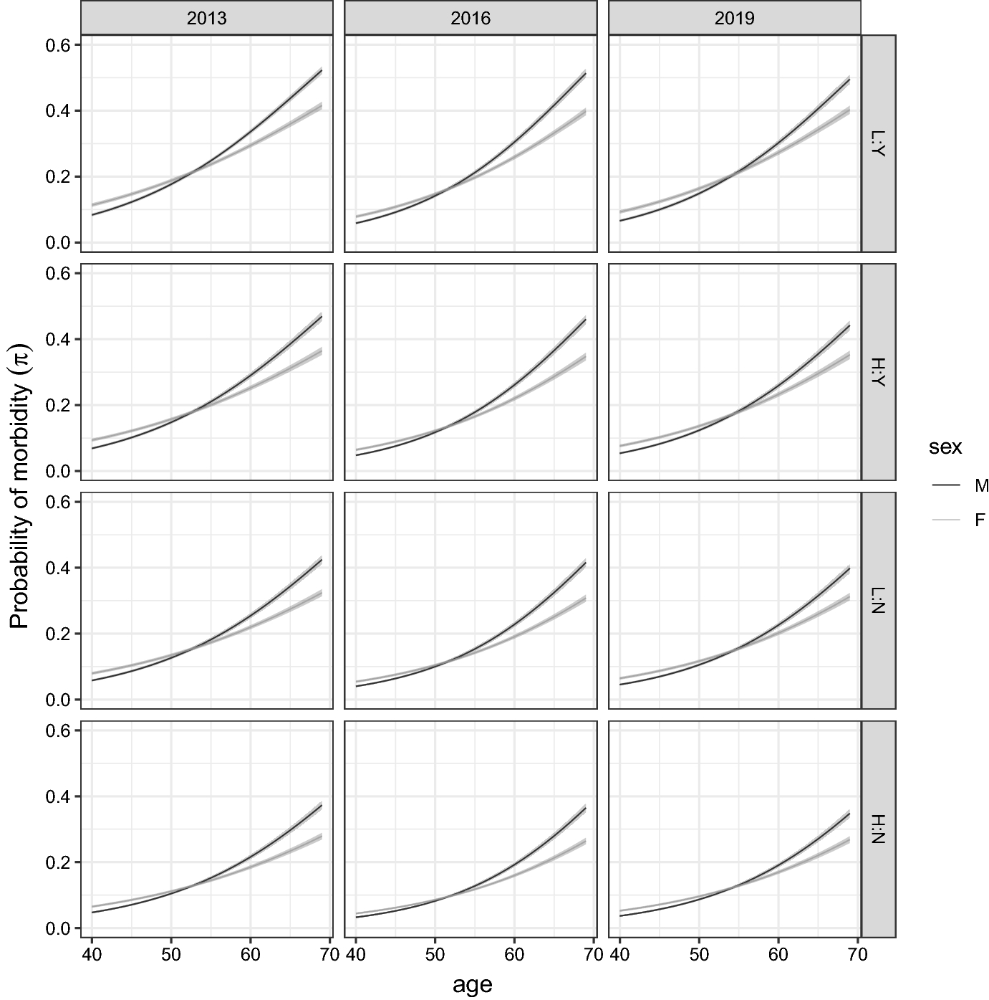

  Research, one bite at a time
  <h1>What do our data tell us?</h1>
  

    Short stories from So.Sta. research. One question, one visual, one result worth pausing for.
  

<!-- BITE 1 -->

<article class="research-bite">

HEALTH · AGEING · 2026

<h2>Are we living longer — but sicker?</h2>

Longer life does not automatically mean healthier life.

Using US data on cardiovascular disease and diabetes, we investigated whether morbidity is being postponed to older ages — the so-called <em>compression of morbidity</em> — or whether chronic disease is expanding across the life course.

The analysis looks beyond average trends, showing how trajectories differ across generations and social groups. The result is a more nuanced picture: improvements in longevity need to be evaluated together with inequalities in health, income and risk factors.

<strong>Take-home message:</strong> adding years to life is not enough. The real challenge is adding healthy years.

<a class="bite-link"
href="https://doi.org/10.1038/s41598-026-48747-1"
target="_blank">Read the paper →</a>

How disease prevalence changes across age and birth cohorts.

</article>

<!-- BITE 2 -->

<article class="research-bite reverse">

MULTIMORBIDITY · 2025

<h2>Not all chronic diseases weigh the same.</h2>

Counting diseases is easy. Understanding their burden is harder.

Multimorbidity is often measured simply by counting how many chronic conditions a person has. But diabetes, cancer and respiratory disease do not have the same impact on health.

Our work proposes a latent-variable approach that treats multimorbidity as a multidimensional phenomenon, allowing diseases to contribute differently to an individual’s overall health burden.

This makes it possible to study whether the burden of multimorbidity is shifting towards older ages — and whether that process differs across socioeconomic groups.

<strong>Take-home message:</strong> multimorbidity is more than a disease count.

<a class="bite-link"
href="https://doi.org/10.1186/s12963-025-00421-w"
target="_blank">Read the paper →</a>

A multidimensional view of chronic disease burden.

</article>

<!-- BITE 3 -->

<article class="research-bite">

MORBIDITY · ITALY · 2023

<h2>When does morbidity really start?</h2>

There is no single age at which people suddenly become “old”.

Instead of defining ageing using a fixed threshold, we studied how the probability of having a chronic condition changes continuously with age.

Using Italian health-surveillance data, the analysis compares morbidity curves across time and socioeconomic groups. This allows us to ask not only whether morbidity is becoming more or less common, but also whether its onset is shifting to later ages.

The curves also reveal persistent inequalities: healthier ageing does not occur in the same way for everyone.

<strong>Take-home message:</strong> the onset of morbidity is a process, not a birthday.

<a class="bite-link"
href="https://doi.org/10.1007/s10260-022-00668-9"
target="_blank">Read the paper →</a>

Age-specific morbidity curves reveal when health begins to deteriorate.

</article>